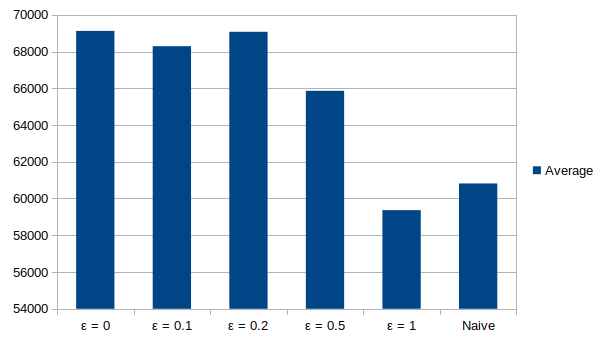

% Multi-Armed Test Distribution
% Joe McCall; Chris Zahuranec
% 03-23-2020

---
fontfamily: mathptmx 
geometry:
- margin=1in
header-includes:
  - \usepackage{mathtools}
abstract: |
    When an infectious disease such as COVID-19 infects an area, a common problem is a shortage of test kits. The resulting lack of adequate information on the spread of the disease makes
    it difficult to mitigate. Furthermore it is reasonable to conclude that the novel nature of such diseases imply a limited supply of testing capability at first. This experiment runs on
    data pulled from a public data source on actual infection rates, and explores whether or not the classical artificial intelligence problem of the multi-armed bandit yields useful 
    test distrubiton strategies. Specifically, the epsilon-greedy algorithm is tested against a uniform-distribution model to determine if, given a more limited test supply, it out-performs
    the naive approach.
bibliography: 
   - nyt_dataset.bib
   - fdoh.bib
csl: ieee.csl
header-includes:
  - \usepackage{mathtools}
...

<!--
The report is a PDF-converted document that must contain the following information:

* A description of the data structures used in the code.
* Data source
* Methods - Epsilon-Greedy
* Methods - Scoring

The descriptions should be concise. The report itself should be no longer than 2-3 pages.
--> 

# Introduction

During the COVID-19 pandemic, test kits were distributed among counties to help assess the spread of the disease, and determine whether or not treatment was necessary. Ideally there are 
adequate tests for every person in a geographical area, but given the novel nature of the disease the test kits were in short supply.

While test kits are manufactured every day, the distributor of those test kits is left with a dilemma: should one distribute more to areas that appear to be experiencing more infections? If so, how much of the limited test kits should be allocated to highly-infectuous areas and how much should be allocated to areas with low levels of infection?

By combining positive and negative cases into a "score," one could model this problem as a classical multi-armed bandit problem, which illustrates the dilemma between exploration and exploitation. The multi-armed bandit problem imagines a row of slot machines (colloquially known as one-armed bandits) that produce a seemingly random score when an arm is pulled. In such a problem, the agent must decide which arms to pull, considering one of the arms may produce a higher score when pulled more than the other arms. However, if the agent only pulls one arm, he loses out on the opportunity to explore a potentially higher-value arm. The agent can only pull so many arms in a period of time - hence the dilemma. Several algorithms exist to help solve this problem. 

Specifically, the exploration of areas with low infection rates should be reconciled with the exploitation of areas with high infection rates. Given the multi-armed bandit problem is established, one can apply several known solutions to this problem and evaluate its performance against real publicly-provided infection data [@NYTData]. This paper explores the epsilon-greedy algorithm as applied to infected counties.

The goal is to use an artificial intelligent agent to smartly distribute limited test kits where they are needed most. Can an artificially intelligent agent out-perform a naive approach of equal test distribution? Such an agent would help mitigate the test kit shortage until enough test kits can be distributed for everyone.

# Methods

The application is written in the Python programming language and uses an object-oriented programming design. Data is provided from [@NYTData] and [@FDOH] and parsed into accessible data frames. Both the naive agent and an epsilon greedy agent are provided. One is chosen in the simulation class before the experiment is run.

## Classes

The code follows an object-oriented approach. Some classes have subclasses that offer a specific implementation of its purpose.

* Simulation - the container that sets up the simulation, defining the start/end dates, agents to use, and number of test kits available per-day.
* Environment - the container for the environment state at a specific day. Simulates the passage of time and computes the score of the agent.
* Agent - an abstraction of the agent that defines the sensors (`consume_result`) and actuators (`distribute_test_kits`).
  * NaiveAgent - a specification of Agent that distributes test kits evenly among all the counties.
  * EpsilonGreedyAgent - a specification of Agent that uses an epsilon-greedy approach to distribute test kits while balancing the exploration/exploitation trade-off.
* County - a county under simulation
* TestKitEvaluator - an asbtraction of a means to evaluate a test kit
  * RandomTestKitEvaluator - a specification of TestKitEvaluator that evaluates the test based on the result of a coin-flip
  * PandasTestKitEvaluator - a specification of TestKitEvaluator that reads in data from a dataset (using the Pandas library) to determine the appropriate percent of positive cases detected, and  evaluate the test kit based on that percent chance of positivity.
* ResultConsumer - an abstraction of a class that consumes the result of the test
  * PrintResultConsumer - prints the results of all the tests for that day to STDOUT
  * PandasResultConsumer - stores the results in a Pandas data frame for later use
* ScoringStrategy - defines the scoring strategy in use
  
## Data Acquisition and Storing (Pandas)

Pandas is an open source python library that is heavily used in the data science community that allows for the easy acquistion, transformation, and storage of data.  Pandas was used in the follow ways for this project:

* Obtaining actual infection data from NY times that contains data by county and provides dates, infection counts, and death counts.
* Transformed the data from the entire United States to the five counties in Florida used for this project
* Computing, retrieving, and storing actual infection results and test results from the test kits the agent distributed
* Creating the graphs that are both generated when the simulation runs and the graphs included in this report

## Simulation Overview

The simulation run with a start and end date, provided as parameters in the simulation class. Each day $N$ test kits are distributed among $M$ counties. The test kits are evaluated based on percent of population infected for that day, as reported by the actual data sources. The environment then evaluates the score for each county under simulation based on the configured scoring strategy. Those results are fed as inputs to the agent to help determine which counties receive additional test kits. Once all the test results are in the agent distributes the test kits according to its configured algorithm (in this case, epsilon-greedy). At the end of the simulation the scores for each county are summed to display the final score. The pandas library will also generate a graph that compares the distribution of tests against the increase of cases among the tested counties.

## Naive Agent

The test kits for day $i$ ($N_i$) is described in @fig:naiveAgent. It is simply the distribution of test cases evenly among the number of counties being simulated.

$$
N_i = \frac{N}{M}
$${#fig:naiveAgent}

## Epsilon-Greedy Agent

The epilon-greedy agent is described by a constant defined as $\epsilon$, which is used in the computation of test kits distributed to the highest scoring counties per-day. This is illustrated in @fig:epsilonGreedyAgent. If the number of detected cases in the county the previous day (given by $S(i-1)$) is the greatest number (given by $max(S)$), then the number of additional test kits is is $N(1 - \epsilon)$. These are considered the "exploitation" test kits. The remaining "exploration" test kits are distributed evenly among all the counties.

$$
N_i =
\begin{dcases}
N(1 - \epsilon) + \frac{N\epsilon}{M} & S(i-1) = max(S) \\
\frac{N\epsilon}{M} & S(i-1) \ne S(P_m) 
\end{dcases}
$${#fig:epsilonGreedyAgent}

In other words, the value of $\epsilon$ indicates the agent's preference of exploration to exploitation. When $\epsilon = 1$, the behavior agent's behavior is identical to the naive agent. When $\epsilon = 0$ the agent distributes all of the test kits to the first county that reports a positive result.

## Score Function

The agent's effectiveness is computed based on both its measure of positive and negative tests. The number of points awarded for a positive test result is V_p, and for a negative test result is V_n. See @fig:score, where $S$ is the score for the agent being tested, $D$ is the number of days, $C$ is the number of counties, and $P_m$ is the number of measured positive cases in the simulation.

$$
S = \displaystyle\sum_{c=1}^{C}\displaystyle\sum_{d=1}^{D}(V_p P_m(c, d) + V_n N_m(c, d))
$${#fig:score}

## Test Evaluation

A test kit returns positive at a percent equal to the actual percent of positive cases for the county as reported by [@NYTData] for that day. See @fig:test, where $R_m(i, j)$ is the positive rate for county $c$ at date $d$.

$$
R_m(c, d) = \frac{P_a(c, d)}{T_a(c, d)}
$${#fig:test}

The test is positive if a random float between 0 and 1 is less than $R_m(c, d)$.

# Experiment

## Parameters

The experiment was run on the following counties in Florida:

* Miami-Dade
* Broward
* Palm Beach
* Monroe
* Collier

These counties were chosen due to their proximity to one another and their differences in case numbers. The test simulated test kits being distributed between 21 January 2020, and 18 April 2020. A positive test is rewarded ten times higher than a negative test ($V_p = 10$, $V_n = 1$).

The naive agent was run first, then the epsilon-greedy agent was run with $\epsilon$ values of 1, 0.5, 0.2, 0.1, and 0.

## Assumptions

* Test kit capacity remains constant throughout the simulation
* The population of each county is estimated by the total number tested (as reported by the Florida Department of Health [@FDOH]).

# Results

| Agent | Average Score |
|---|---:|
| NaiveAgent | 60820 |
| EpsilonGreedyAgent, $\epsilon$ = 1 | 59368 |
| EpsilonGreedyAgent, $\epsilon$ = 0.5 | 65862 |
| EpsilonGreedyAgent, $\epsilon$ = 0.2 | 69072 |
| EpsilonGreedyAgent, $\epsilon$ = 0.1 | 68288 |
| EpsilonGreedyAgent, $\epsilon$ = 0 | 69120 |

The test was run with several values of $\epsilon$, along with the `NaiveAgent`. The results are graphed in Figure 1.

{ width=80% }

It is useful to view these results within the context of the data from the data-set to reveal how close they are to actually measured data. These are illustrated in figures 2 and 3. The top line represents the actual positive cases found during the reported time period, while the bottom line shows the positive test cases found by the agent during a simulated trial. The y-axis uses a logarithmic scale due to the large difference between the measured cases and the actual cases.

{ width=80% }

{ width=80% }

\pagebreak

# Conclusion

We found that our scoring algorithm rewarded exploitation heavily over exploration. The performance of the `NaiveAgent` performed slightly better than the performance of the `EpsilonGreedyAgent` with $\epsilon$ = 1.

As with many fields in AI the choice of a scoring function is very important when modelling real-world applications. Our simulation concluded that distributing the limited test kits to only the highest-infected county was the winning strategy. This conflicts with common knowledge, as at least some test kits must be distributed to uninfected counties in order to discover their infection rate. Put another way, our scoring function led to a local maxima, leaving the agent no choice but to continue distributing test kits to the highest county. The exploitation choice was favored heavily over the exploration choice.

There are further improvements that can be made. The local maxima can be alleviated with simulated annealing. Also, this experiment focused on five counties in Florida, but tests for more counties could prove useful. Further work could test the score of other solutions to the multi-armed bandit problem. A more sophisticated algorithm could take into account the county density, for example. Also the scoring function could be adjusted to reward negative test results, as those hold value as well as positive results. Another area worth exploring is training a neural network based on historical pandemic data to predict which areas should be prioritized before test kits are distributed.

Given the success of the multi-armed bandit problem when modelling other domains, there is high value in continuing this exercise with more advanced techniques. The problem of limited test kits will not be solved, given that novel diseases require novel test kits. While this experiment revealed a weakness in a specific choice of a scoring function, it still serves as a framework upon which new work can be built.

# References
