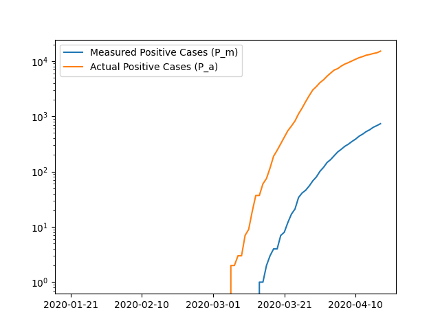
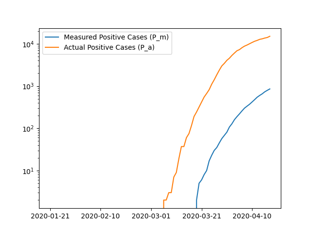

% Multi-Armed Test Distribution
% Joe McCall; Chris Zahuranec
% 03-23-2020

---
fontfamily: mathptmx 
geometry:
- margin=1in
header-includes:
  - \usepackage{mathtools}
abstract: |
    When an infectious disease such as COVID-19 infects an area, a common problem is a shortage of test kits. The resulting lack of adequate information on the spread of the disease makes
    it difficult to mitigate. Furthermore it is reasonable to conclude that the novel nature of such diseases imply a limited supply of testing capability at first. This experiment runs on
    data pulled from a public data source on actual infection rates, and explores whether or not the classical artificial intelligence problem of the multi-armed bandit yields useful 
    test distrubiton strategies. Specifically, the epsilon-greedy algorithm is tested against a uniform-distribution model to determine if, given a more limited test supply, it out-performs
    the naive approach.
bibliography: 
   - nyt_dataset.bib
csl: ieee.csl
header-includes:
  - \usepackage{mathtools}
...

<!--
The report is a PDF-converted document that must contain the following information:

* A description of the data structures used in the code.
* Data source
* Methods - Epsilon-Greedy
* Methods - Scoring

The descriptions should be concise. The report itself should be no longer than 2-3 pages.
--> 

# Introduction

During the COVID-19 pandemic, test kits were distributed among counties to help assess the spread of the disease, and determine whether or not treatment was necessary. Ideally there are 
adequate tests for every person in a geographical area, but given the novel nature of the disease the test kits were in short supply.

While test kits are manufactured every day, the distributor of those test kits is left with a dilemma: should one distribute more to areas that appear to be experiencing more infections? If so, how much of the limited test kits should be allocated to highly-infectuous areas and how much should be allocated to areas with low levels of infection?

By treating the number of positive cases as the "score," one could model this problem as a classical multi-armed bandit problem, which illustrates the dilemma between exploration and exploitation. Specifically, the exploration of areas with low infection rates should be reconciled with the exploitation of areas with high infection rates. Given the multi-armed bandit problem is established, one can apply several known solutions to this problem and evaluate its performance against real publicly-provided infection data [@NYTData]. Since the data is given by counties, the simulation will be run with counties.

The goal is to use an artificial intelligent agent to smartly distribute limited test kits where they are needed most. Such an agent would help mitigate the test kit shortage until enough test kits can be distributed for everyone.

# Methods

## Classes

* Simulation - the container that sets up the simulation, defining the start/end dates, agents to use, and number of test kits available per-day.
* Environment - the container for the environment state at a specific day. Simulates the passage of time and computes the score of the agent.
* Agent - an abstraction of the agent that defines the sensors (`consume_result`) and actuators (`distribute_test_kits`).
  * NaiveAgent - a specification of Agent that distributes test kits evenly among all the counties.
  * EpsilonGreedyAgent - a specification of Agent that uses an epsilon-greedy approach to distribute test kits while balancing the exploration/exploitation trade-off.
* County - a county under simulation
* TestKitEvaluator - an asbtraction of a means to evaluate a test kit
  * RandomTestKitEvaluator - a specification of TestKitEvaluator that evaluates the test based on the result of a coin-flip
  * PandasTestKitEvaluator - a specification of TestKitEvaluator that reads in data from a dataset (using the Pandas library) to determine the appropriate percent of positive cases detected, and  evaluate the test kit based on that percent chance of positivity.
* ResultConsumer - an abstraction of a class that consumes the result of the test
  * PrintResultConsumer - prints the results of all the tests for that day to STDOUT
  * PandasResultConsumer - stores the results in a Pandas data frame for later use

## Simulation Overview

* Simulation run for T days.
* Each day N test kits are distributed among M counties
* Test kits evaluated based on percent of population infected for that day
* Score for each "arm" (county) computed based on number of positive results
* Results are fed into the agent to help determine the distribution of test kits
* The agent distributes the test kit
* The score for the agent is computed and added to the county
* At the end of the simulation the scores for each county are summed to display the final score.

## Naive Agent

The test kits for day $i$ ($N_i$) is described in @fig:naiveAgent. It is simply the distribution of test cases evenly among the number of counties being simulated.

$$
N_i = \frac{N}{M}
$${#fig:naiveAgent}

## Epsilon-Greedy Agent

The epilon-greedy agent is described by a constant defined as $\epsilon$, which is used in the computation of test kits distributed to the highest counties per-day. This is illustrated in @fig:epsilonGreedyAgent. If the number of detected cases in the county the previous day (given by $P_m(i-1)$) is the greatest number (given by $max(P_m)$), then the number of cases is $N(1 - \epsilon)$. These are considered the "exploitation" test kits. The remaining "exploration" test kits are distributed evenly among all the counties.

$$
N_i =
\begin{dcases}
N(1 - \epsilon) + \frac{N\epsilon}{M} & P_m(i-1) = max(P_m) \\
\frac{N\epsilon}{M} & P_m(i-1) \ne max(P_m) 
\end{dcases}
$${#fig:epsilonGreedyAgent}

In other words, the value of $\epsilon$ indicates the agent's preference of exploration to exploitation. When $\epsilon = 1$, the behavior agent's behavior is identical to the naive agent. When $\epsilon = 0$ the agent distributes all of the test kits to the first county that reports a positive result.

## Score Function

The agent's effectiveness is computed based on how close its value came to the actual values for each county. A perfect score in this case would be 0, since every day the agent distributes the perfect number of test kits that are all positive. See @fig:score, where $S$ is the score for the agent being tested, $D$ is the number of days, $C$ is the number of counties, $P_a$ is the number of actual positive cases from the data set, and $P_m$ is the number of measured positive cases in the simulation.

$$
S = \displaystyle\sum_{i=1}^{D}\displaystyle\sum_{j=1}^{C}|P_a(i, j) - P_m(i, j)|
$${#fig:score}

# Experiment

## Parameters

The experiment was run on the following counties in Florida:

* Miami-Dade
* Broward
* Palm Beach
* Monroe
* Collier

These counties were chosen due to their proximity to one another and their differences in case numbers. The test simulated test kits being distributed between 21 January 2020, and 18 April 2020.

The naive agent was run first, then the epsilon-greedy agent was run with an epsilon value of 0.5.

## Assumptions

# Results

| Agent | Score |
|---|---:|
| NaiveAgent | 183794 |
| EpsilonGreedyAgent | 183066 |

The graph of the results of these agents are found in Figure 1 and Figure 2.

# Conclusion

The agent that employed epsilon-greedy outperformed the naive agent slightly. This indicates that it is preferable to distribute more test kits to a county with a higher number of previous cases than it is to keep the test kit distribution even.

<!-- TODO our scoring function could use work. If epsilon is 0 we maximize our score, which is incorrect. We need to ensure that the agent is penalized more for neglected counties -->

This experiment focused on five counties in Florida, but tests for more counties could prove useful. Further work could test the score of other solutions to the multi-armed bandit problem. A more sophisticated algorithm could take into account the county density, for example. Also the scoring function could be adjusted to reward negative test results, as those hold value as well as positive results. Another area worth exploring is training a neural network based on historical pandemic data to predict which areas should be prioritized before test kits are distributed.

# References
